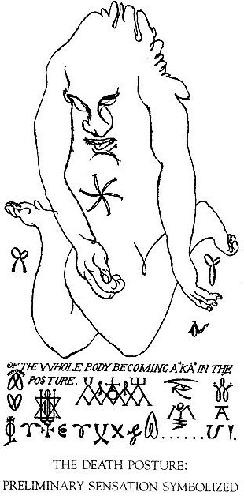

### 🐌 「知られざる呪術師」による注釈

>🔸 死の姿勢に関する注釈（信念構造の解体と二元性の超越） 
>この章においてスペアは、「信念」と「意志」の分離こそが苦悩の源であると断じ、その解決の手段として「死の姿勢（Death Posture）」を提示する。これは象徴的な概念にとどまらず、実際に行われる儀式的身体技法であり、以下の思想が中核に据えられている。 
>- 信じることと望むことがズレていると、人は必ず苦しむ。スペアによれば、「自分が信じていること」と「本当に望んでいること」が食い違っていると、どんな喜びも長続きせず、やがて悲しみや後悔に変わってしまう。 
>- “ナイザー＝ナイザー”とは、すべての考えをいったん手放す原初の状態である。スペアは、善悪や正誤といった二元的な考えに巻き込まれないためには、「どちらでもない」としていったん全てを脇に置く“ナイザー＝ナイザー”の態度に戻ることが必要だと説く。 
>- 信念や精を「出さずに保つ」ことで、より深く世界に影響を与えられるようになる。スペアは、信念や精（semen）を外に放出せずに保つことで、それらがより純粋で力強いエネルギーとなり、他人の深層意識にまで届くほどの力を持つようになると述べている。 
>  
>🔸 実践パートに関する注釈（儀式的身体操作と視覚ワーク） 
>スペアは複数の“死の姿勢”を提示するが、それはすべて「信念を解体し、自己愛（Self-Love）によって自己を再構築する」ためのものである。いずれも「快楽の書」というタイトルにふさわしく、肉体的快感と精神的自由が交差する地点に導くワークである。 
>
>🐌 死の姿勢の手順（本文に基づく抜粋要約） 
>
> 1️⃣ 怠惰・微笑・忘却の姿勢 
> - 仰向けに寝る 
> - 体全体をあくびするように弛緩させる 
> - 微笑みを浮かべる 
> - 「時間を忘れる」「意味の喪失」を感じる 
>
> 2️⃣ 極限の緊張を用いた姿勢 
> - つま先立ちになる 
> - 両腕を後ろで組み、できるだけ強く引っ張る 
> - 首を上に伸ばす 
> - 激しい呼吸をする（過呼吸状態） 
> - めまいや感覚の断続的な噴出が起きるまで維持 
>
> 3️⃣ 鏡と視覚ワーク 
> - 鏡をじっと見つめる（自分の顔が曖昧になるまで） 
> - 視線がぼやけて「自分が誰か分からなくなる」まで観察を続ける 
> - 目を閉じ、視覚化された「光（Xの形）」を保持する 
>
> 🧠 補足的記述（思想的背景） 
> 死の姿勢は「信念と意志の不一致」をリセットするためのプロセス 
> この状態は「Neither-Neither（ナイザー＝ナイザー）」への移行を補助する 
> 精（semen）と信念を「未受精」にとどめておくことが、宇宙的な浸透力とつながる 
>

---

🇯🇵 死の姿勢 (Death Posture)

 

 
自己の観念同士が互いに衝突し続けているかぎり、それらは“抵抗”によって存在し続ける。どんな死や策略をもってしても、それを打ち破ることはできない。むしろ、そうした介入はかえって、それらのエネルギーを増幅させてしまうだけだ。死者は再び生まれ変わり、良心という名の子宮の中に横たわる。真の“成熟”を許すということは、いずれ朽ちることをも前提とするということ。そして、それを本当に成し遂げるためには、“非抵抗”こそが必要なのだ。非抵抗によって、私たちは初源の単純さへと回帰し、想念のない統一へと通じる。この「想念」から、ある一つの公式が芽生える──それが、「気にするな。自分を満足させろ」という、非抵抗の教えなのである。

「私は在る（I am）」という想念があるかぎり、文法的な必然として「私は在らず（I am not）」という観念がそれに続く。この苦しみに満ちた世界では、ちょうど昼のあとに夜が来るように、あらゆる観念が対をなして現れる。たとえば、痛みを「痛み」として認識するためには、あらかじめ「快楽」という観念が前提にある。この構造は、すべての観念に共通している。そしてこの二元性のもとでも、もし彼が──いつでも笑うことを忘れず、すべてを受け入れ、いかなるものにも抗わずにいられるなら──そこにはもう、葛藤も、不一致も、強制も存在しなくなる。

**明快な象徴性によって、概念を超える**

「男」という概念は、常に「女」を含意している。だが私は、それら両方を──「両性具有（Androgyny）」によって超えてゆく。そして「両性具有」という概念は、さらに「去勢者（Eunuch）」【6】という存在をも含意している。だが私は、それらすべてを超えて、「いずれでもない（Neither）」という原理に至る。たとえこの「Neither」が曖昧に見えるとしても、その概念を想起することができるという事実そのものが、それが“触れうるもの（palpable）”であることの証明となっている。だとすれば──その先には、さらに別の「いずれでもない」【7】が存在するはずである。

「Neither-Neither（二重の否定）」の原理とは、思考があらゆる“概念化”を超えた状態である。この状態には“対になるもの”が存在せず、それ自体の中にしか意味を持たない。ゆえに、そこでは「均衡」という概念さえも成り立たない。このとき、「私（I）」という原理は、「どうでもいい（Does not matter）」「存在する必要はない（Need not be）」という地点にまで到達している。それは、いかなる形態（Form）からも切り離された、純粋な意識の状態である。そして──この状態を除いて、他に“何もの”も存在しない。ゆえに、この状態だけが「完全」であり、「永遠」なのだ。破壊されることなく、他を破壊しうるこの原理こそが、唯一の「真の自由」であり、唯一の「実在」である。この状態を通して、私たちはあらゆる悲しみから免疫を得ることができる。だからこそ、「精神」は歓喜そのものとなりえる。

すべてを手放し、この道で示された方法によって──その状態に身を委ねよ。確信をもって言おう。そここそが、Kia（キア）の住処なのだ。たとえ象徴的であっても、一度でもこの状態に触れた者は、時間と二元性から、無条件に解き放たれる。ただ「快楽」だけを残して、すべての観念から自由になったとき──カルマ（苦しみという法則）は、急速にその力を失っていく。そして、時間の外にあるその一瞬において、新たな“法”が具現化される可能性が開かれる。そこには、もはや苦しみという代償は存在しない。すべての願いが満たされ、「彼」【8】は満たす者そのものとなる。そして、その「新しい法」とは何か──それは神秘的なアンバランス、「どうでもいい」「そうでなくてもよい」という奥義（アルカナ）に他ならない。もはや“こうすべき”という必然性は消え去り、残される信条は──ただ一つ、

**「自分の好きにすればいい（Please yourself）」【9】**

その日には、ついに「自発的な意志（Deliberation）」が可能となる。隷属ではなく、自ら選び取った信仰だけが、真実として立ち上がるのだ。「彼」【10】は──すなわちKiaは──この模倣（＝Kiaの模倣）を喜ぶ。それは、すべての政治体制が私に教えてくれた“真理”でもある。──しかし、「彼」自身は、いかなるものにも支配されない。

それがKia──至福そのもの。

これこそが、新たな協定（New Agreement）によって成立する自己満足の科学（Glorious Science）であり、自己認識を通じた自己愛の術（Art of Self-love）であり、非抵抗によって到達するエクスタシーの心理学（Psychology of Ecstasy）なのである。

>**6:** 性なき者（Sex-less）
──「去勢者（Eunuch）」を指す。性の二元性を欠いた存在として、象徴的に「男性／女性」の対立から自由である状態を表す。

>**7:** これら（両性具有・去勢者など）は二元的存在であり、自然界における原初の性的原理に対応している。
Spareはこれらの象徴を、神聖文字（sacred alphabet）へと拡張しているが、それは通常の言葉や文法では説明しきれないほど深遠であるため、ここでは明言を避けている。

>**8:** 「彼（He）」とは、自我（Ego）を指す。
ここでの“彼”は、単なる第三者ではなく、自己内在する主体そのもの＝エゴ意識を象徴する。

>**9:**「信念」は常に“否定”を求め、
「満ちること」や「増殖による充実」を通じて、それ自体の自由を維持しようとする。
Spareの思想において、信念とは固定されたものではなく、否定と反復のサイクルで保持される動的構造である。

>**10:** 「彼（He）」──つまりエゴは、ついに
「絶対者（the Absolute）」へと変容する。
エゴが対立や執着を超え、「満たす者（gratifier）」として機能しはじめることで、個の自己が“絶対的自己”へと変質するという思想を示している。

**儀式と教義（The Ritual and Doctrine）**

まず、仰向けにだらりと横たわる。身体は、まるであくびをしかけているときのように、緩く、自然に。微笑みながら、ゆっくりと息を吐く──このとき大切なのは、「微笑によって概念する」こと。この姿勢の核心は、まさにそこにある。かつて自分にとって必要だと思い込んでいたものたちを、そっと手放そう。それらが持っていた“意味”すら、いまはただ無意味に思えるように──そのように、静かに忘れていく。そして──時間が溶けたように感じられる一瞬、そのとき、“徳”が自然と発現する。

次に、別の姿勢を取る。つま先立ちになり、両腕を背後で組み、できるだけ強く引き絞るようにしながら、首をぐいと後ろに反らせる。そして、深く、断続的な呼吸を続ける。めまいが起き、感覚が突発的な波のように押し寄せてくるまで、この姿勢を保つこと。
これによって、前述の「死の姿勢」に至るための、肉体的・精神的な“消耗状態（Exhaustion）”が生じる。この“消耗”こそが、意識を空（から）にするための準備状態であり、魔術的創造へと至る「入口」なのである。

鏡に映った自分自身の姿を、じっと見つめる。その像がぼんやりと滲み始め、「誰が誰を見ているのか」がわからなくなるまで──その瞬間が訪れたら、そっと目を閉じよう。（※多くの場合、自然にまぶたが閉じる）そして今度は、心のなかで“視る”作業を始める。そこで見えてくるのは、光のようなもの──それは、いつも「X」のかたちを描くような、奇妙な軌道（curious evolutions）をたどっている。この光を、決して手放してはならない。意識が操作していることすら忘れるほどに、深く集中し続けるのである。

やがて、まるで自分が「巨大な空間（immensity）」そのものになったような感覚が訪れる。その中には、自分自身の“小さな姿”が見えている。だが、その“姿”の限界には──決して手が届かない。

この練習は、先ほど紹介した実技（死の姿勢など）を試す前に行うべきものである。そしてこのとき湧き上がってくる「感情（emotion）」こそが──なぜ自分がこの行為を行っているのか、その「答え（knowledge）」を告げてくれる。

死の姿勢（Death Posture）とは、“避けがたいもの”を加速させるための手段である。それを通じて、私たちは「執着による果てしない遅延」から解放される。エゴ（自我）は、烈風に吹かれて舞い上がる一枚の葉のように、軽々と飛ばされる。そして──決して確定しない時間のなかで、「いまにも起こりそうだったこと」が、ついに現実となる。これまで曖昧なまま隠れていた“自明のこと”が、ようやくはっきりと姿を現すのである。

そのとき、人は初めて、自らの意志で「自分を喜ばせる」ことを知る。これこそが、「信仰を否定する唯一の道」である。そしてこの道は、生きることで体得されなければならない。

意識の二元性が終わりを迎えるとき──そこにこそ、「真の自由」がある。
信念（Belief）とは、「肯定された死の状態」であり、それ以外のすべては、ただの“眠り”──否定のなかで惰性として続く状態にすぎない。

死の姿勢とは、私たちがこれまで信じていたものすべての「死体」である。そしてやがて、私たちは“目覚めた死体”として再び立ち上がるのだ。エゴ（自我）は、法則に従属するかぎり、眠りと死という“惰性”を求めてさまよい続ける。だからこそ、死の姿勢を知ることだ。それは“法則を無効化する”という現実であり、二元性を超えていく昇天（Ascension）なのである。

その日──涙ひとつない嘆きのなかで、宇宙は灰に還る。──だが、「彼」はその“審判”から逃れる。では「私」は？──なんという不幸な存在なのだろう！だが、この自由の中には、もはやいかなる必然性（necessitation）も存在しない。私はこれ以上、何を語ることができるだろうか？いや、きっと私はこれからも多くの罪を犯すだろう。──だが、それでも私は、自分自身を妥協するよりはマシだと思っている。

「予備的な練習（Preliminary Exercises）」は、無数に存在する。──それは、まるで“罪の数”と同じくらい多い。それぞれの練習自体には絶対的な意味はないが、それらは“最終手段”を指し示すための徴（しるし）である。

死の姿勢とは、あらゆる観念──つまり「罪」と呼ばれるものすべて──を、「いずれでもない（Neither）」の状態へと還元すること。そして、欲望が「自己を喜ばせること」によって満たされる地点へと至ること。この方法によって──そして、この方法によってのみ、信念の惰性（inertia of belief）は静かに消えていく。新たなセクシュアリティは再び甦り、原初的な「自己愛」は、自由のうちに回復される。

この「原初の空（vacuity）」──あるいは「信念の根源」とも呼べるこの状態は、あらゆる観念的な対象──たとえば「統一」と「二元性」、「混沌」と「均整」といったもの──を否定することによって得られるものではない。

これは、「いま、この瞬間にやること」だ。「いつか、あとで」ではない。“反対物”を介さずに──ただ、知覚し、感じるのだ。まるで影を通さずに、「光を、光自身の色として」見るかのように。そのために必要なのは、合一（ユニオン）のエクスタシーの最中に、「笑い」という感情を意識的に呼び起こすことだ。その笑いを何度も練習し、疲れることなく、微細に、持続的に保てるレベルにまで高めていく。

このようにすれば、あらゆる反応（リアクション）の法則は力を失う。「拒絶」するのではなく、「含む」ことで、それを超えていくのだ。たとえ人が100の快楽を同時に味わい、そのエクスタシーが限りなく高まったとしても──彼は何ひとつ失わない。むしろ、そこには「大きな増加（great increase）」が起こるのである。

だからこそ、彼はこれを日々の実践として行うべきなのだ。──そうして、欲望の中心（the centre of desire）に至ること。それは、「偉大なる意志（Great Purpose）」の模倣にほかならない。このようにして、あらゆる感情は“放出（emanation）”の瞬間において均衡（equipoise）を保ち、やがて“ひとつ”へと統合されるべきである。

ゆえに──もし「信念」と「精（semen）」とが“受精（conception）”することを妨げるならば、それらは単純（simple）にして宇宙的（cosmic）なものとなる。そして、それがもたらす“光（illumination）”によって、この世界には──もはや説明できないことなど、何ひとつなくなるだろう。

たしかに、私は「エクスタシー」の中にこそ、真の満足を見出してきた。そしていま──私はあなたに、きわめて重要な秘密を語った。それは、私が幼い頃から知っていたことだ。たとえ人が、「信念の空虚（vacuity）」を得ようと努力するだけでも──その純粋な意識状態によって、他者の奥深くにまで入り込み、彼らの存在を“楽しむ”ことさえできるようになる。

人間の多くは、自分が何を本当に信じ、何を本当に欲しているのかを知らない。もしそれを知りたいのなら、まず自分の「信念」がどこにあるのかを突き止め、その先にある「意志（will）」を見つけるのだ。人は「二元性」として存在するかぎり、その欲望は本質的に同一（identical）だ。だが、まさにその“二元性”ゆえに、制御が失われている。なぜなら、「信念」と「意志」は常に衝突し、互いを自分の望む方向へと曲げようとするからだ。しかし、結果として「信念」と「意志」のどちらかが勝つことはない。なぜなら、その喜びは──すでに「悲しみの隠れ家（covert of sorrow）」となっているからである。

だからこそ、あなたは、「信念」と「意志」を統合しなければならない。

---

🇬🇧 原文を表示（別ファイルで開く）

🔗 [原文を読む 05_death_postur_en.md](05_death_postur_en.md)

---

© 2025 知られざる呪術師（Le Sorcier Inconnu）
本ドキュメントは Creative Commons BY-SA 4.0 に基づき公開されています。

