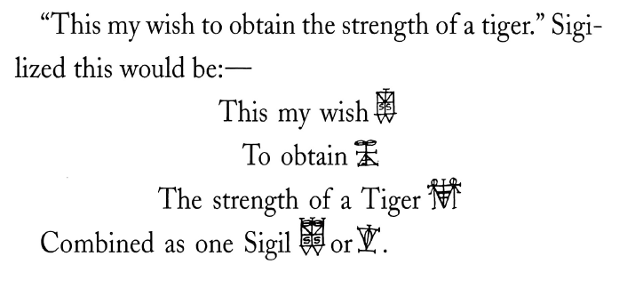

### 🐌 「知られざる呪術師」による注釈

>🔸 スペアが語る「信じるとは何か」（信念と魔術の関係） 
>スペアはこの章で、「信じる」という行為そのものを再定義しようとしている。以下の3つの視点が要点である。①「知る」ではなく「なる」こと。対象を知覚するのではなく、そのもの“になる”ことでのみ理解が得られる。これは彼にとっての魔術的変容（transmutation）の中核である。②感覚遮断ではなく“常識”への回帰。修行的な感覚遮断を否定し、常識的な知覚（common-sense）を通じて魔術が成り立つという姿勢。これは、神秘主義の既成観念とは逆である。③真理は他者ではなく自己からのみ現れる、いかなる師匠や外部体系からも真理は得られない。「自己愛（Self-love）」の思想とここでの「自己観察の徹底」は同じである。
>
>🔶 スペアによる「天才（Genius）」の定義（潜在意識と変容） 
>スペアは「天才とは何か」を次のように定義している。知識ではなく“生きること”が学びである。知識は再発見にすぎず、真の学びは“生きた経験”のみ。固定された「自我」を否定し、流動的な意識へ。スペアにとって「天才的直観」は、善悪に縛られない流動的な“中空の自我（I）”によって可能になる。Neither-Neitherは“天才の意識状態”。この状態とは、すべての前提や信念を一時停止し、直観と純粋観察を開くゲートである。スペアはこれに「慣れ親しんだ者」こそが天才だと語っている。
>
>🔸 スペアとコリン・ウィルソンの進化論的欲望 
>スペアの「コウモリが翼を得たのは、飛びたいという欲望が潜在意識に浸透したから」という考え方は、進化を意志や欲望の産物として捉える独自の生物観である。これはコリン・ウィルソンが『オカルト』で語っている「キリンの首が伸びたのは高い木の葉を食べたいと“思ったから”」という進化観と驚くほど類似しており、ウィルソンがスペアを読んでいた可能性がある。

---

🇯🇵 魔術の儀式と教義──完全版

**自己愛における法悦──執着という現象**

最愛なる者よ──いまこそ私は、この世界の闇を打ち砕く、唯一の安全で、そして真実なる秘法を明かそう。それは、あらゆる秘密の中でも最も奥深く、成就を真に望む者にだけ秘されたままにしておくべきものだ。この実践に必要な時間は、その人の「理解の深さ」によって異なる。だが、そこに資格【18】は必要なく、儀式もいらない。なぜなら、彼の存在そのものが、すでに「完全性に必要なすべて」を象徴しているからだ。したがって、繰り返しや、形だけの模倣には何の意味もない。なぜなら──あなたは、すでに生きているのだから。

魔術とは、属性を単純化し、変換可能な状態に還元すること──すなわち、再利用可能なものとして方向性を与え、資本化することなく、何度も実を結ばせるための技術である。意識的に考えすぎたり、集中しすぎたりすることは、魔術にとってはむしろ「抵抗」であり、「へつらい」であり、最終的には「知的愚かさ」に至る。もし彼が「快楽」や「力」のいずれかのために欲望を成就しようとするのであれば、その欲望は魔術によって終息させねばならない。彼はそこで、同等の強度【19】をもつ別の欲望が現れるのを待ち、その新たな欲望（またはその成就）を、最初の欲望に捧げることによって、量子的かつ有機的な連結を果たす。この時点では、彼はまだ「法（law）」【20】から自由ではない。

したがって、幻滅が訪れたとき──つまり、信念が脱落するその瞬間を待たねばならない。【21】まさにその「失望」こそが、彼にとってのチャンスである。この「自由となった信念」と欲望は、シジル（聖なる文字）を通じて目的に結びつけられる。意識をひとつの部位に集中させることで感覚は分散せず、むしろ強度を増す。欲望をその対象以外には向けずに保留することで、それは心理的なタイミングで、自己決定的に達成される。非抵抗──すなわち、意図しない思考と行動を受け入れる姿勢をとることで、心配や成就しないことへの不安は一過性のものとなり、彼の内には定着しない。なぜなら、彼はもはや「あらゆるものを欲する者」になっているからである。

欲望に対する「不安」は、その目的を妨げ、かえって欲望を露出させ、固定してしまう。意識的に抱かれた欲望には、魅力がない。心が静かで集中しており、外的イメージによって乱されていない状態であれば、感覚の印象は歪められず（すなわち幻覚に陥ることなく）、すでに内にある欲望は自然と増幅され、対象と密やかに結びつくことができる。

>**18:** 「資格（qualification）」の不要性について
>　魔術の手段が「単純性（simplicity）」である限り、実践者は自分で条件や制限を設定する自由をある程度持っている。しかし、それによって「過剰な制限」や「引きこもりの儀式」を課すならば、それは彼自身の無能を証明し、目的の空虚さを露呈するものとなる。
>　Spareは「儀式的な撤退」や「禁欲的自己試練」などを嘲笑している。

>**19:** 「欲望の強度が等しいもの」とは？
>　特別な条件を必要としない、ごく自然な欲求（just a natural desire）のこと。
　ここで重要なのは、抑圧されていない素直な欲望がエネルギーの源となるという点。

>**20:** 「法（Law）」に信を置く者への短縮式
　この簡易式（desireとbeliefの結合によるシジル化）は、欲望に従って日常を送る家庭人や信仰のある者にとって有効であるとされる。Spareは一貫して「実践」の重要性を説くが、日常生活におけるそれも排除しない。

>**21:** 「幻滅の瞬間」の例
　たとえば「友人への信頼を失ったとき」や、「愛による結びつきが期待を裏切ったとき」などがそれにあたる。信念の崩壊＝欲望の開放という視点は、Spareの魔術論の一端をなす。

**内なる影を投影する**

自我（Ego）が完全に忘却されていないときは、ただシジルの形を保持し、視覚化せよ。それは杯（chalice）であり、「空」への到達と具現化のための手段である。その瞬間に、同質の感情を意図的に想起することで、彼は法（＝反応）を代行する者となる。このとき彼は、この世界では知られざる均衡を体現し、他のすべての意識が安全に消去される中で、恍惚のための「器」として十分に強固な存在となる。彼はもはや傷つかない。そして今、彼は次のように想起すべきである──自我と絶対者との神秘的な合一が起きるのだと。

そのとき放たれる「蜜（ネクター）」【22】を、ゆっくり、何度も味わえ。この驚異的な体験の後、彼の情熱はもはや他の何者とも比べがたくなり、「望まない限り」何ものも欲することはなくなる──ゆえに、人々は私のことを理解できないのだ。その恍惚の感情こそが、万象生成の源（omni-generative）である。これを「生命の蜜」と知れ──太陽と月の交わり（Syllubub）。まことに、彼は天から火を盗んだ──それは世界で最も勇敢な行為である。ただし、恍惚の屈折（refraction）【23】を除いたあらゆる意識的な熟慮（deliberation egotized）は危険である。それは過去の経験に主導権を明け渡し、「一時的な自由」の中に意識が閉じ込められた結果として、二重人格（＝狂気）を生み出すことになるからだ。

>**22:**「蜜（ネクター）」が身体的現象として感じられる場合、そのときは他者の身体を想像せよ──その身体には、彼が創造したシジルが宿っているか、緊急的に投影されたものとみなされる。それがもともとの目的ではなかったとしても、彼はそれを「意志する」ことになる。そしてそれはきわめて愛すべきものとなる（exceedingly amiable）。

>**23:**「恍惚の屈折（refraction）」とは、この文脈においては、笑い（laughter）を指す。

これらの手段によって、「成就を超えるような欲望」は存在せず、「素晴らしすぎて達成できないような事柄」も存在しない──すべては、「どれだけ自由な信念を持てるか」【24】にかかっている。

>**24:**「自由な信念（free belief）」が多いほど、すべては可能になる。欲望をひとつの感覚に局在化させることで、その感覚器官が超越的ヴィークル（乗り物）となる。たとえば耳を使えば、あらゆる存在（動物・人間など）の声とハーモニーが一体となった「この世で最も超越的な音楽」が聴こえる──他の感覚でも同様の応用が可能である。

快楽も冒険も乏しい小心者たちよ──己の目的すら忘れ、あら探しに明け暮れ、強欲で、罪深く、女なしでは生きられず、苦痛なしでは快楽を感じられない。臆病で、移り気で、病み、干からび、他者に依存し、残酷で、騙されやすく、そして嘘つき──最も堕落した人間たちよ！　だが、聞くがいい。ああ、我が主よ、我が愛しき〈自己〉よ──私はいま、「あの最も秘密の酒場」のことを語ったのだ。そこは、情熱が青春の終わりとともに向かう場所。誰であれ、その扉を叩きさえすれば、無償にして万人に恩恵をもたらす恍惚の蜜（ネクター）を味わえる。それは、誰ひとり傷つけることのない、もっとも歓喜に満ちた滋養なのである。

**魔術的憑依（天才）と狂気の違いについての覚え書き**

魔術的憑依とは、無意識の活動を、自らの意思とタイミングによって、式文（フォーミュラ）を用いて喚起し、その結果として精神が照らし出される状態のことである。これは、すなわち「天才の状態」を指す。これに対して、その他の憑依とは、「盲人が盲人を導く」ようなものであり、クワイエティズム（静的受動）によって引き起こされる。それは「ミーディアム的状態（mediumism）」として知られ、自我（Ego）が外部からのあらゆる影響──精霊的存在、エレメンタル、あるいは肉体を持たないエネルギー──に対して、無防備に開かれてしまっている状態を意味する。

こうした状態は「意識の変成」ではあるが、真の無意識活動に対する抵抗作用にすぎず、自発的な狂気である。これは、自我が「形」や「制御」を持たずに夢遊状態にあるようなものであり、その放出物は、愚かしい示唆や、ただの幼少期の記憶にすぎないものとなってしまう。

狂気として知られる、あるいはそれに関連づけられる「憑依（Obsession）」とは、何らかの拒絶によって人格（エゴ）から乖離した体験である。これは「準結晶的（sub-crystalline）」なものであり、潜在意識に恒久的に定着することはない。なぜなら、それはまだ実現（realisation）を通じて自らを使い果たし、完了していないからである。その憑依がエゴに認識されるか否かは、体験の強度と、それに対して過去に示された抵抗の度合いに依存する。いずれの場合も、その表出は自律的（autonomous）であり、個人的なコントロール、方向づけ、タイミングとは切り離されている。また、「集中」しすぎることは乖離（dissociation）を引き起こす要因となる。たとえば、ある対象への熱狂が高まりすぎて自己同一化による完結を求めると、他のすべてを犠牲にするか、意図的に忘却することになる。その結果、当該欲望や対象が自我から切り離され、意識の他の部分と同等かそれ以上の重みを持つようになると、人格の分裂（二重人格）が起きる。この分離の原因は、その欲望自体の過度な強さ、または欲望が満たされなかったときのショックによって生じるのである。

集中とは、満たされぬ欲望であり、それは決して満たされることのない葛藤である──その手段ゆえに。エゴが、自らに欲望を満たす手段がない、あるいはそれを知らないと感じるとき──それは否認・抑圧・想像上の代償・変容などを通じて、その不安から逃れようとする。だが、こうした行為は、欲望や強迫の「消滅」ではなく、エゴの他の部分からの分離や隠蔽にすぎない。それは、「早すぎた潜在意識としての存在」である。

こうした状態は、なんらかの「抵抗」が働いているあいだのみ保たれる。だが、抵抗が休眠すると、支配的な強迫が主導権を握り、エゴの中に具現化され、エゴを圧倒し、感情的な体験を通じて“生きざるをえない”状況に至る。病と狂気（すべての病は狂気である）は、肉体を持たないエネルギーが“生命機能”を持たないときに起こる。そして、このようなエネルギーこそが、シジル（意志の象徴）を活性化するために用いられる力なのである。

**シジルとは何か？**

**信じるという心理学**

知識を調べつくしても、そこから得られるものはない。たとえ「それら」が知られたとしても、その研究は無益である。私たちは、知覚によって対象を知るのではなく──対象そのものになることによって、それを理解するのだ。感覚の扉を閉ざしたところで、何の助けにもならない。私は、「常識（common-sense）」を自らの教えの基礎としよう。さもなくば──どうやって聴覚のない者に「意味」を伝え、盲目の者に「ヴィジョン」を与え、死者に「感情」を届けることができるだろうか？
比喩と言葉の迷宮の中では、直観（intuition）は失われてしまう。だからこそ、努力なしに学ばねばならないのだ──「自分自身」についての真実を。唯一その真実を知っている者から──つまり、あなた自身から。

処女の知恵（Virginity）の価値など、無知という誘惑者に犯されてしまった者にとって、いったい何の役に立つだろうか？あらゆる科学や知識も、それが薬（medicine）として用いられるのでなければ、何の意味があるというのか？隠された宝は、言葉によっても、道ばたを素手で掘ることによっても、手に入るものではない。たとえ適切な道具と、正確な場所の知識があったとしても──それによって得られるのは、かつて自分がすでに所有していたものにすぎないかもしれない。それが本当に「隠されている」のかどうかさえ、じつのところ怪しいのだ。なぜならそれは、あなた自身の経験の地層や、信念の空気層によって覆われているだけかもしれないのだから。

今、あなた──「汝（Thee）」によって投げかけられたその核心的な問いこそ、少しでも“天才（Genius）”の片鱗を求める者が問うべきものだ。私の答えは、まるで壮大な“胚種”のように、この宇宙のすべてと調和している──単純でありながら深遠な意味に満ち、そして一時的には、あなたの抱く「善」や「美」の観念にとって、きわめて不快なものに映るだろう。だが聞け、熱心なる求道者（Aspirant）よ。情報を求め、心躍らせているあなたにこそ、私のこの答えを真剣に聞いてほしい。なぜなら──その意味を“生きる”ことでこそ、あなたは「根源的な無知（constitutional ignorance）」という束縛から、ほんとうに解き放たれるのだから。
あなた自身がそれを“生きなければ”ならないのだ。私が代わりに生きてやることはできない。

天才（Genius）の主たる原因とは、「リアリゼーション（実現）」──すなわち、「私（I）」という感覚が、ある種の感情によって閃光のごとく、知覚されたものと一体化することにある。この感情は、「非道徳的（immoral）」である。なぜなら、それは信念という装飾（accessories）を一切必要とせずに、知識を自由に連想させることを許すからだ。このときの意識状態とは、「私は在る（I am）」や「私は在らず（I am not）」といった概念の不在──つまり、忘我（absentmindedness）としての信仰状態である。そしてこの状態がもっとも優れているのは、「ナイザー＝ナイザー（Neither-Neither）」──自由で、空気のように拡がる〈私〉（free or atmospheric "I"）という在り方においてである。

若い頃、あなたはふと「この世界は奇妙な場所だ」と感じたことを覚えているだろう。そして、「この人生は本当に理にかなった展開なのだろうか？」という、“なぜ？”という問いを感情として強く感じた瞬間も。では、その感情の原因は何だったのか？そしてなぜ、それをあっさり心から追い払ってしまったのか？さらに思い出してみてほしい──ごくありふれた物体が、なぜか壮麗なまでに奇妙に見えたことを。そのとき、通常は結びつかないようなもの同士のあいだに、何か関係があるのではないかという曖昧な感覚もあっただろう（理屈好きな人々はこうした感覚をよく経験するが、たいていはすぐに言い訳してしまう）。創造の神秘とより深く接したときの驚きと衝撃──あれほど親密な感情をなぜ真剣に追求しないのか？「驚きとは何か？」という問いに立ち向かおうとしないのはなぜか？なぜあなたは、犬の喧嘩よりも神の存在の方を信じているのか？けれど、実際に恐れているのは神よりも犬のほうではないか？あなたが敬虔さに窒息しそうになっているその姿と、無垢な赤ん坊の姿のあいだに──本質的に何か違いがあるのだろうか？もしかすると、こうしたところにこそ、私たちの「無知の原因」があるのかもしれない。

信念とは、「絶対（Absolute）」からの堕落にほかならない。では、あなたは何を信じようというのか？──真理とは、つねに自らの否定を欲している。異なる側面を集めても、それらは真理ではないし、真理にとって必須でもない。その放射（エマネーション）の中で、あなたはどれを生まれる前に絞め殺そうとするのか？あなたは「非嫡出児（illegitimate）」なのか？「正しさ」と「間違い」を信じているのなら──あなたは、どんな罰を定めるつもりなのか？「～すべき（Must）」という強迫から逃れられる者がいるだろうか？変化なしに、退屈から逃れられる者がいるだろうか？独りで、しかも満ち足りていられる者が？あなたの中に、「自己（self）」を丸ごと抱えられるほど大きく、自由な者がいるのか？あなたの信念は、あなた自身の“血統（lineage）”を曇らせてしまっている。野心とは「小ささ」であり、それはあなたが慣れ親しんだ環境の延長にすぎない。覚えておくといい──時間とは、「経験されたこと」によって形成された、まだ誰もきちんと学んでいない空想（imagination）なのだ。いわゆる「初期の経験」と呼ばれるものは、すでに完成されていた。つまり、学びには終わりなどない。

明日あなたが学ぶことは、昨日すでに実践したことによって決定されている。今日できることを、明日まで学ばないという態度は「損失」と呼ばれるが、実際は時間や健全さ、若さからの“盗み”にすぎない。この「遅延」を繰り返すうちに、あなたはやがて、「安全な偶発性（chance in safety）」──すなわち、自発性（spontaneity）にたどり着くことになるだろう。「学び（＝信じること）」を追い求めるその姿勢こそが、“愚かさ”という奇怪な孵卵器（incubator）なのだ。

もしあなたが、本当に「信じる」ことができるのなら──私たちは、その効力（ヴァーチュー）を実感できるはずだ。だが私たちは、「信じたい」とどれほど願ったとしても、自由に信じることなどできはしない……なぜなら、その前に相反する観念たちを、すべて使い尽くしておかねばならないからだ。シジルとは、「信じるという技法」である。それは私が発明した、信念を「有機的（organic）」なもの──すなわち〈真の信念〉へと変えるための技術なのだ。

「信じたい」と願ったとき──その願いが、すでに心の中にある別の信念と両立できない性質のものであるなら、それは「有機的な信念」を妨げてしまい、現実化されることはない。つまり、「信じたいという願い」が、そのままその願いの否定になってしまうのだ。この状態では、「信仰」は山をも動かさない。なぜなら、まずその信仰自身が自己否定として機能しているからだ。

たとえば、私が「偉大でありたい」と願い、それを前提に「私は偉大だ」と信じ込もうとしたとしても──（いまの私が「そうでない」ことを前提にしているかぎり）──たとえ最後までその“信じるふり”を続けたとしても、それで偉大になれるわけではない。それは儀式的な不誠実さ（ceremonial insincerity）にすぎず、私の「無能さ（incapacity）」を正当化してしまう。私が「無能である」と感じているならば、それこそが“真の信念”であり、有機的に根づいたものなのだ。違うふうに信じようとするのは、ただの見せかけにすぎない。だからこそ、「私は偉大である」という想像や“信仰”は、表面的な信念でしかなく、それに伴う反作用や否定感は──実のところ、有機的な無力感が内側で沸騰している証拠である。「否定」や「信仰」は、それを変えたり消し去ったりするのではなく、むしろその状態を強化し、維持してしまう。

だから、信念が“真に作用する”ためには、それは有機的で、潜在意識に根ざしたものでなければならないのだ。たとえば「偉大でありたい」という欲望があるならば、それが「有機的」になるためには──まず「空（vacuity）」の状態を通過し、シジルという形に託すことが必要だ。そして、シジルの形を意識的に思い出してしまったときは、それを意図的に忘れる努力をしなければならない。そうすることで、シジルは無意識の中で活動しはじめ、その形が欲望に栄養を与え、それが潜在意識に結びつき、「有機的な信念」へと転化していく。このプロセスが完了したとき──その人は、まさに自分が描いた「偉大さの概念」そのものになるのである。

信念は、それに意識的に抗いながら形を与えることによってこそ、真に実在し、生命力を持つようになる。それは、「信仰による努力（striving of faith）」によってではない。信念は、「自白（confession）」と「非抵抗（non-resistance）」──すなわち、意識による明け渡しによって自らを使い果たす。だからこそ、「信じないために信じる」のだ。そうすれば、ある程度の割合で、信念は「存在」として現れるようになる。そのタイミング（timeliness）は、あなたの「道徳観（morality）」に左右される──つまり「貧しき者に与えよ（give to the poor）」というわけだ。野心的な者たちがもしも知っていたならば──「無能になること」は、「偉大になること」と同じくらい難しいということを。なぜなら、それらはどちらも達成（accomplishment）であり、同じくらいの満足を与えるものだからだ。

**無意識こそが天才を生む**

すべての天才たちは、「潜在意識（sub-consciousness）」が活発に働いている──そしてそのことに無自覚であればあるほど、彼らの成し遂げる業績は偉大になる。潜在意識は、そこに達した欲望によって利用される。したがって、意識（consciousness）の中には、いったんエゴが「大いなる願望（great desire）」を抱いたあとは、その願望を残しておくべきではない。むしろ、表向きには全く異なることへの“見せかけの野心”で満たしておくべきなのだ──その逆をしてしまうと、「どこかに潜んでいる臆病さ（cowardice）」の当然の代償を支払うことになる。それは、不名誉な自己欺瞞ではないか？天才性とは、英雄的行為と同様、「勇気」の問題だ。つまり、恐れや無力感をどうにかして忘れなければならない──だからこそ、天才の表現はいつも「自発的（spontaneous）」なのである。実のところ、天才になることはとてもシンプルだ──あなたはもう「その手段（means）」を知っている。では、誰がその「飛躍（plunge）」を実行するのか？「どうやって？」を学ぼうとすることが、永遠に答えの出ない「なぜ？」を抱え続けることに他ならない。天才とは、「どうして」「なぜ自分がそうなのか」を知らないからこそ天才なのだ。

**常に開かれている、記憶の宝庫**

潜在意識とは、これまでに存在したあらゆる経験と叡智──**過去の転生における人間、動物、鳥、植物など、すべての存在の総縮図（エピトーム）であると知れ。それらはすべて、「進化の秩序」における層（stratum）として存在している。したがって、これらの層を深く掘り下げていけばいくほど、私たちはより古い生命形態にたどり着くことになる。そして最後に至るのが──「全能の単純さ（Almighty Simplicity）」なのだ。もしも私たちがその存在たちを目覚めさせることができれば、私たちは彼らの特性を獲得することができ、その成果もそれに見合ったものとなる。

ただし、そうした存在たちは非常に古い記憶の奥底にあるため、それらを喚起するには、きわめて曖昧な暗示（vague suggestion）が必要となる。そしてそれは、心が異常なほど静まり、単純になったときにしか作用しない。彼らの叡智を得るということは、必ずしも彼らの「身体」を必要とするという意味ではない──身体は常に「手段（means）」に応じて変化するからだ。たとえば、私たちは狩りをするヒョウよりも速く移動するが、その体を持っているわけではない。必要なのは身体ではなく、その特性なのだ。自然界を観察すれば、初期の生命形態がいかに驚くべき適応力と力を持ち、時には不滅であるかがわかるだろう。欲望が何であれ、それは常に「その成就そのもの」として存在している。たとえば、微生物（microbe）には世界を破壊するほどの力がある──もしそれが私たちに関心を持てば、実際にそうするだろう。手足を切り落とされたとしても、その部分は再び成長する。

このように、そうした存在を喚起（evoke）し、憑依され、照らされる（illuminated）**ことによって、私たちは彼らの魔術的な特性、あるいはその到達の知識を得ることができる。これはすでに「常に起こっていること」でもある──ただし、非常にゆっくりとした速度で。私たちは知識を得ようとあくせく努力することで、むしろそれを遠ざけてしまう。心は「シンプルな食事」によってこそ、もっともよく働くのだ。

**予言の鍵（The Key to Prophecy）**

進化の法則とは、「機能の退行」によって「到達する力」が決定されることだ。たとえば鳥のように空を飛ぶ存在になりたいという欲望が、潜在意識の深層に届いたとき──それによって私たちも翼なしで飛ぶ存在になるかもしれない。つまり、潜在意識が本当の「能力」や「知識」の源泉であり、それ以外の手段で得られる知識は、せいぜい肥料のような補助物にすぎない。私たちが日常的な手段で知識を学ぼうとする価値は、その「苦しみ」や「失望」の中にある。そうした精神的な疲労が偶然にも本当の知識の居場所──潜在意識にアクセスする可能性を開くのだ。インスピレーションは常に「空白（ヴォイド）」の瞬間にやって来る。偉大な発見の多くは偶然によるものであり、その多くは精神的な疲れによってもたらされる。私の「シジル（sigil）」の技法は、まさにこの潜在意識を活性化させるための方法だ。シジルは、天才性や進化を加速させる魔術的装置なのである。

たとえば、コウモリが翼を持ったのは、単に「飛びたい」という欲望が強かったからではなく、その欲望が潜在意識の深層にまで染み込んでいたからだ。逆に、私たちのように飛びたいと表層意識で願う者は、機械を使わなければ飛ぶことができない。天才というものには、往々にして「仮説」や「趣味」がある。それは表層意識を適度に誤魔化し、潜在意識の自発的表現を邪魔しないようにするためのトリックだ。レオナルド・ダ・ヴィンチの数学や技術への興味も、そのような意識の「欺き（sigil）」である。私たちの人生は、自分を支配する「カルマ（業）」の象徴に満ちている。 無意味な装飾や過剰な衣服が人々を喜ばせるのは、彼らがそこに自分の「業」の象徴を見出すからであり、それこそがカルマの位置を示す鍵となる。「王に戴冠させる」という儀式の象徴は、「神に似た存在」としての人間が、潜在意識の最下層──一細胞レベルの根源に到達したことを意味する。だが実際の王はその理想の象徴にすぎず、現実ではない。真に「王」となる者は、分割される以前の「二」なる原理を、極限の単純さにおいて理解した者である。

シジルと「空（くう）」の習得によって、過去の転生や経験を意識に召喚することができる。眠っているときに夢として起こることもあるが、この方法は非常に困難である（「昼と夜の夢を楽しむための章」は省略）。完全な「空（くう）」の状態は、道徳やコンプレックスに縛られた者──つまり、信念の中心が自己愛でない者──にとっては困難かつ危険である。だからこそ、シジルのような技法が必要なのだ。あらゆる儀式、セレモニー、条件などは、すべて任意のものであり（自分自身を喜ばせるためのもの）、しばしば妨げや混乱の原因となる。それらの起源は遊戯にあり、後に「真理を知られないようにするため」、または「無知を誘発するため」に発展した。そして例によって、最も騙されたのは高位の祭司たち自身である。他者を欺く者は、自分自身をさらに深く欺くのだ。だからこそ、派手な衣装、儀式、引きこもりの修行、ばかげた条件などを愛する者を見れば、彼がペテン師であると見抜けるだろう。彼らの教義は、虚勢を張ること、名声を渇望する臆病さに過ぎない。彼らが掲げる基準は、すべて「不要なもの」であり、ゆえに失敗は確実なのだ。

こうして、多少の才能がある者も、彼らの教えによってすぐにそれを失ってしまう。彼らはただ表面的なことを教え込み、増殖させるだけである。もし私が教師であったなら、弟子に「自分よりも知らぬ存在」として接することはないだろう。弟子は「弟子である」という意識を持てないだろう。彼はゆっくりと同化し、自分が学んでいることにも気づかず、致命的な失敗を繰り返すこともないだろう。恐れを持たずに、楽に達成することができるだろう。唯一可能な「教え」とは、人が「自分自身の知恵から学ぶ方法」を示し、「自らの無知と失敗」を活かす方法を教えることである。正しさ（righteousness）によって、その人の視野や意志を曇らせてはならない。

**シジル──保護された信念**

**魔術的憑依（Magickal Obsession）について**

いま、私はシジルの創造と使用方法について説明しよう。何の難しさもない。すべては驚くほど純粋で明晰なのだ。【25】私は愚かな信奉者たちへの愛ゆえに、これを発明した。快楽・知識・力──どんな欲望であっても、それが「自然な」形で表現できないとき、シジルとその手法によって、潜在意識の力を通じて欲望を成就させることができる。シジルとは、部分的に自由な信念【26】を有機的な欲望と結びつけ、その欲望を潜在意識の中で保持・運搬し、最終的にはエゴに再帰させるための装置である。あらゆる思考は、正しい関係性のもとで形（form）として表現可能である。シジルとは思考のモノグラム（単体記号）であり、エネルギーを制御するための記号である（すべての紋章、家紋、モノグラムはシジルであり、それに対応するカルマを象徴している）。また、欲望を数理的に象徴化し形を与える手段でもあり、それによって“魔術の時間”においてその欲望を一切思考せずに済むようになる。これによりエゴによる干渉を回避し、その欲望が記憶・イメージ・不安といった一時的な心象に結びつけられることなく、潜在意識へと自由に流れ込むことが可能になる。

>25：このシステムの唯一性について 
>この手法を使えば、自分のシジルが何を指すべきか、つまり自分が何を信じているかを明確に把握することができる。　逆に、もしシジルの形をいい加減に（stupidly）使った場合、望んでいなかったもの（たとえば狂気の母体）を召喚してしまうか、あるいはまったく何の効果も現れない。本書によれば、このシステム以外による成果はすべて偶発的なものであり、「儀式魔術師の扮装」「高価な神殿や処女羊皮紙」「黒ヤギの血」などといった伝統的な演出（theatricals）や見せかけ（humbug）は一切不要だと明言している。この点が、本書の「実用的な個人魔術」の精神をよく表している。

>26：部分的に自由な信念（partially free belief）とは何か。ここでいう信念（belief）やエネルギーとは、まだ執着や妄念として固定されていない「未満状態」の欲望を指す。つまり、失望（disappointed）したが、まだ執着（obsession）になっていない欲望であり、それゆえに「シジルによる転送」が可能なのだ。

シジルとは、アルファベットの文字を簡略化・結合して作られる図形である。【27】たとえば「Woman（女性）」という語をシジル化するなら、いくつかの例（図示）が考えられる。同様に「Tiger（虎）」という語も複数の簡略図として表すことができる。ここで重要なのは、視覚的にすぐ思い浮かべられる形であること、そしてその図形が欲望と過度に似すぎていないこと。つまり、図形は抽象的である必要がある。シジルを作る真の技法には、さらに高度な効能がある。これは短くは説明できないが、「思考のかたち」を扱う秘儀であり、「名前に込められた暗示の段階構造」と深く関係している。

ここまでで、シジルの作成法とその効力について、われわれはひとまず合意に達した。人がシジルを通じて信じるものは、必ず実現する──それが「真実」となる。このシジルの体系は、大きな失望や悲嘆に見舞われたときに「趣味」として始めるのが理想的である。私はこのシジル技法を通じて、愚者に知恵を授け、賢者を愚者に変え、病者を癒し、強者に病を与えたこともある。たとえば「虎のような強さが欲しい」と願うなら、次のような文を作るとよい。

“This my wish to obtain the strength of a tiger.”（私の願い──虎の力を得ること）

なお、「This my will」から始めると、より効果的であるという指摘もある。

この文を構成要素に分け、それぞれを簡略化して図案化（シジル化）する：

- This my wish → （図例）
- to obtain → （図例）
- the strength of a tiger → （図例）

これらを統合して1つのシジルにする（例示あり）。さらに簡略化した形（図）も考えられる。

 

>**27:** この書に示されるシジルには6つの異なる手法があり、それぞれが異なる潜在意識の層に対応している。ここで例示されているものは、それらすべてに共通する基本的なアイデアを示すものであり、誰でもこの基礎から自分自身の体系を発展させることが可能である。条件や必要性は後から自然と進化していく。むしろ、表現手段を限定することで創造性と独自性は増すのだ。

このシジルの力によって、あなたは自身の「欲望」を潜在意識へと送り込むことができる──そこには、あらゆる力が収められている。そして一度送り込まれた欲望は、それに必要な知識または力が顕現することで実現（realization）されることになる。まず、シジル以外のあらゆる意識を消し去らなければならない。

これは「集中（concentration）」と混同してはならない──むしろ、「何かを考えそうになったら、ただシジルの形を想起する」だけでよい。虚無（vacuity）【28】は、心身を何らかの手段によって「消耗（exhaustion）」させることで得られる。どんな手段でも構わない──個人的なものでも伝統的なものでもよく、それは気質（temperament）によって選べばいい。快く感じる方法を選ぶべきである。たとえば「マントラや特定の姿勢（posture）」「女と酒」「テニス」「トランプ遊び（patience）」「散歩しながらのシジルへの集中」など、どれも有効である。だが、「ナイザー＝ナイザー」の実践によって、象徴的にでも一瞬でも「二元性（conception）」を打ち破った者にとっては、こうした手段すら必要ない。そのとき、エゴ（自己）は重力（gravity）から自由になっているからだ。シジルが「常に意識される強迫観念（obsession）」となれば、その実現はいつでも起こりうる──たとえばインスピレーションというかたちで。特に効果的なのは、極度の不安や疲弊の瞬間に、意識を再びシジルへと戻すことである。この「消耗と空」のタイミングこそが、まさに成就の瞬間なのだ。その時、ただ「シジルの形」だけを視覚化して保持するようにせよ。するとそれは、やがて曖昧になり、消えていく──そのとき、成功は保証されている。

エゴがシジルだけを想起し、それ以外の何ものもそこから想起しない状態では、すべてのエネルギーがその一点を通して集中される。そして「一体化（identification）」への欲望が、それを対応する潜在意識の層（stratum）へと運んでいく──すなわち、それが目的地（destination）となる。シジルは「乗り物（vehicle）」であり、意識をその強迫観念（つまり、意識的には認識されていない欲望）の直接的な顕現から保護する役割を果たす。これによって、互いに相容れない観念同士が衝突するのを避け、どちらかが「別の人格」として自立することも防がれる。この「強迫観念」は、ゆるやかに統合されて「有機的（organic）」なものとなるか、あるいは元いた場所へと戻り、その「啓示の目的」は達成される。こうして心は、「欲望の強度」に応じて、知識（illumination）や力（obsession）を、特定のカルマ（Karma）──すなわち対応する潜在意識層、特定の存在・経験──から引き出すことができるのだ。それは決して「最近の記憶や経験」からではない。知識は、欲望とカルマの統一から生じた感覚（sensation）として得られ、力はその「実際的な活性化と復活（vitalization and resurrection）」によって現れるのである。

>**28:** ここで言う「虚無」とは、いわゆるメディアム状態の受動性とは異なる。それは、外的存在やエネルギー（多くの場合、ラップテーブル現象を引き起こすような低次のエネルギー）に心を開くことを意味しない。虚無に至る手段はいくつもあるが、もっとも単純な方法を挙げる。十字架にかけられる必要はないし、薬物も無益である。むしろ喫煙や怠惰は虚無に至る最も難しい道である。

この「知識（illumination）」は、欲望やエネルギーとともに潜在意識の層から生まれ出て、再びエゴへと戻ってくる。それは直接的な形ではなく、顕在意識に存在する過去のイメージ、記憶、経験と共鳴することで、抵抗を回避しながらエゴに受け入れられる。つまり、同質の象徴と結びつくことで、知識は「翻訳可能なかたち」で結晶化するのである。そのため、ほとんどの「啓示」や「霊感（illumination）」は象徴的（symbolic）な形をとり、後から翻訳・解釈される必要がある。

>[このあとに本来含まれているべき章──「象徴論」「自動描画と芸術の関係」「聖なる文字についての覚え書き」などは、この原稿では省略されている。]

**私自身について**

思考したところで、あなたは生命の徴（しるし）を何ひとつ示さなかった。あなたを主張するということは、「価値を創造しようとする労苦」を意味するが──そこに保持すべきものはなく、満たされるものもない。ただ、自らが抑圧されていたという事実だけが現れるのだ。「自己の消滅（self-effacement）」こそが、現実のように思える。だがこの〈自己〉とは、なんと空虚なことか！ なんと不完全さを次々に生み出す存在か！　自己否定のなかで、あたかも現実を装って生きようとするこの衝動……そして次第に現れてくるもの──それは醜い幻想の霧。それらは親的な構造を持ち、「天の憎しみ（Heaven's hatred）」の原因となる！　だから私は、「神」を信じることを恐れている。「属性」への従属、「自己という観念」に服従することは、もはや「愛における自由」ではない。おそらく──神の観念など一度も意識したことのない者こそが、「全能」なのだろう。

いまや私の統一（Unity）の激しさが、あなたにとって「沈黙」であるように。そして私にとって、もはや疑問を抱いたり、疑いを背負って生きるための労苦など必要ないものとなるように。とはいえ──人類は永遠に疑い、偏屈を抱え、あらゆる快楽の代償を払い続け、最後には「百万長者」のように富を積み上げていく。そしてその「罰」は、蓄積した資本（信念や功徳）の査定額に見合ったものとなる──それが、「恐れ（fear）」という代償だ！

世俗的な財（dross）に満ちた者は、良心をごまかすために謙虚さを装い、自らを「貧しい者」と称し、所有物を「重荷」だの「つまらぬもの」だのと言う。だが、耐えがたい監視と待機のなかで、落ち着きのない努力と、牢獄と、拷問と、考えうるかぎりのあらゆる苦悩のなかで──「真実」はいったいどんな慰めとなるのか？やがて彼は、それらに慣れてしまい、現実を失い、もはや何ものにも躊躇しなくなったとき──再び「神」を創り出し、新たな悲劇を招くのだろうか？ああ、愚かな世界よ──信仰を否定せよ。血に染まった王笏（Sceptre）を持つ神を拒絶し、告白せよ。愚行の完成こそが、幼年期のはじまりだ──だが「知識」に終わりはない。迷ったことでこそ、道はまっすぐに見えるのだ。私は幼いころから、自分の不屈の目的を否定したことはなかった。

ああ、沈黙の見守り手よ、宇宙の眠らぬ眼よ──私のすべての思想の始まりを見守っていてくれ。この世界の苦しみは、あたかも永遠であるかのように見える。だが私はその只中にあって、まだ微笑むこともできない幼子のように──「純粋さ（自己愛の純粋さ）」のなかで、何ものにも染まらぬままでいる。だが私は、その純粋さを「奉仕せよ」と命じることは、敢えてしない。私はつねに「実現（realization）」を求めつづけており、貧しいながらも──私の「満足」は、あなたがたの理解を超えている。私は「意見を持つ者（opinionist）」でありながら、論を唱えることを恐れている。自らの教義を「信じる」ことで妥協してしまうのを恐れている。──願わくば、それらの教義が、自らを浄化する存在（expurgers）でありますように。

知識に対しても恐れを抱いている私は、信念そのものが「空」であること」──いや、「無知」こそが信念であることを、信じるだろう。だが、私が宗教や教義、信条を「信じようとした」その大胆さによってこそ──私は真実の宝石を手にすることができるのだ。だから私は極めて慎重に、主張すると同時に否定し、「必然ではない（not-necessity）」という地点にとどまる。パラドックスによってすべてが超克され、過去も原因も持たぬままに、私は自然発生的（spontaneous）に絶対者（the Absolute）へと回帰する。私の陶酔と制御──そしてカルマの反作用（reaction）を見守れ。「道（the Way）」とは、なんと簡単なのだろう。「語られるべきこと」は何もなく、むしろすべてが「語られざるもの」であるかのようだ。

どうか、私の言葉が少なく、しかし豊かでありますように──。ああ、「神の観念」という無意味な考えは、いまだその限界にすら達していない。人々はみな嘘をつき、「狂気」という頂点を目指してもがいている。──そのなかにあって、ただ一人、早熟に老いた者として、理性がその王座でよろめくなかで──私はいまだ正気を保っている。良心も道徳も告白せず、ただ一つの目的において処女のように無垢な存在である。

---

🇬🇧 原文を表示（別ファイルで開く）

🔗 [原文を読む 08_closing_remarks_en.md](08_closing_remarks_en.md)

---

© 2025 知られざる呪術師（Le Sorcier Inconnu）
本ドキュメントは Creative Commons BY-SA 4.0 に基づき公開されています。

