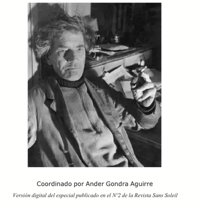

# オースティン・オスマン・スペア『快楽の書』の翻訳＋注釈Zine──ZOS/KIAと魔術の原点

本Zineは、オースティン・オスマン・スペア（Austin Osman Spare, 1886–1956）の代表作『The Book of Pleasure（Self-Love）』の全文翻訳および注釈を収録する試みである。
本Zineはスペア思想の「日本語による初の本格的受肉（インスタンシエーション）」を目指している。

**by 知られざる呪術師（*Le Sorcier Inconnu*）**  

ディスコーディアン暦3191年 ZosとKiaの祝日第52日曜日  
――手✋と目👁によるクラフトが深淵🌀を超えた記念日  

---

 

*ZOSの手、KIAのまなざし。スペアは肉体と意識を一つの芸術行為に還元した。*

---

## 🗂 章構成
 
- [01 定義（Definitions）](01_definitions.md)

- [02 Different Religions and Doctrines as Means to Pleasure, Freedom and Power](02_on_religion_and_faith.md)

- [03 The Consumer of Religion](03_self_love_and_sigils.md)

- [04 Soliloquy on God-Head」](04_kia_and_neither_neither.md)

- [05 The Death Posture](05_death_posture.md)

- [06 The Cloudy Enemies Born of Stagnant Self-Hypnotism.（Soliloquy on Godhead）](06_soliloquy_on_godhead.md)

- [07 Preface to Self-Love](07_on_duality_and_ecstasy.md)

- [08 The Complete Ritual and Doctrine of Magic](08_closing_remarks.md)

---

## 🐌 ZOSとKIA──Spareと後世の違い（要約解説）

オースティン・オスマン・スペアが定義したZOS/KIAは、体系化された神話や教義ではなく、個人の身体と意識を通じて体験される私的で変成的な魔術であった。
ZOSは「手」＝描く身体として、欲望を象徴へと具現化する働きを持ち、KIAは「目」＝観る意識として、そのプロセスを見届ける純粋な主体である。
この象徴的対応は、スペア本人が明言しており、後世の解釈とは無関係である。

一方、ケニス・グラントの「Zos Kia Cultus」**は、これらの概念を神話的体系として整理し、象徴や儀礼、階層構造の中に再配置したものである。
この違いは、ラヴクラフトが描いた「名状しがたい混沌」を、後年オーガスト・ダーレスが善悪の神話体系へと再編した構図によく似ている。

さらに、ZOS＝男性原理／KIA＝女性原理という解釈も一部に存在するが、スペア本人のテキストにおいて、性別の固定的な割り当ては行われていない。
むしろ彼は「Neither-Neither（いずれでもない）」という非二元的状態を重視し、善悪・性・意味といったあらゆる二項対立を超越する態度を貫いている。

---

## 著作権および利用に関する注意

本Zineに収録された翻訳文および注釈は、Austin Osman Spareの著作『The Book of Pleasure（Self-Love）』の原文（パブリックドメインまたはCCライセンス下の版）をもとに、日本語圏における理解促進を目的として作成された。翻訳および注釈部分の著作権は、翻訳者・編者に帰属します。ただし、本Zine全体は以下のライセンス条件に従って公開される。

**ライセンス：Creative Commons 表示-非営利 4.0 国際（CC BY-NC 4.0）**  
https://creativecommons.org/licenses/by-nc/4.0/deed.ja

このライセンスのもと、本Zineの内容は：

- 非営利目的に限り自由に複製・共有・再配布が可能です  
- 内容を改変する場合も、出典を明示すれば許可されます  
- 商用利用は禁止されています  
- 原著者および翻訳者へのクレジット（名前・URLなど）を明記してください

原文の出典（英語）：  
[The Book of Pleasure (Self-Love) by Austin Osman Spare – Internet Archive / Public Domain Source]

---

© 2025 知られざる呪術師（Le Sorcier Inconnu）  
本ドキュメントは [Creative Commons BY-SA 4.0](https://creativecommons.org/licenses/by-sa/4.0/deed.ja) に基づき公開されています。
