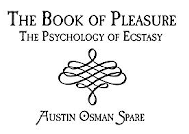

# オースティン・オスマン・スペア『快楽の書』の翻訳＋注釈Zine──ZOS/KIAと魔術の原点

本Zineは、オースティン・オスマン・スペア（Austin Osman Spare, 1886–1956）の代表作『The Book of Pleasure（Self-Love）』の全文翻訳および注釈を収録する試みである。
本Zineはスペア思想の「日本語による初の本格的受肉（インスタンシエーション）」を目指している。

**by 知られざる呪術師（*Le Sorcier Inconnu*）**  

ディスコーディアン暦3191年 ZosとKiaの祝日第52日曜日  
――手✋と目👁によるクラフトが深淵🌀を超えた記念日  

---

 

---

## 🗂 章構成
 
- [01 定義](01_definitions.md)

- [02 宗教は、欲望の取り扱い説明書なのか？](02_on_religion_and_faith.md)

- [03 宗教を食らう者](03_self_love_and_sigils.md)

- [04 神性についての内なる問い](04_kia_and_neither_neither.md)

- [05 死の姿勢 (Death Posture)](05_death_posture.md)

- [06 停滞した自己催眠が生み出す、濁った敵（神性についての独白）](06_soliloquy_on_godhead.md)

- [07 自己愛を語る前に](07_on_duality_and_ecstasy.md)

- [08 魔術の儀式と教義──完全版](08_closing_remarks.md)

---
## オースティン・オスマン・スペア（Austin Osman Spare, 1886–1956）
<table> <tr> <td style="vertical-align:top; padding-right:20px;">
20世紀初頭のロンドンに生きた芸術家・魔術師・思想家。10代で画壇の寵児となるも、既存の芸術・宗教・魔術体系すべてに背を向け、自らの内的ヴィジョンに従った独自の魔術体系「Zos Kia」を構築。人間の無意識を“描く身体（ZOS）”と“観る意識（KIA）”という対概念で捉え、シジル魔術や自己愛を軸にした極めて個人的・即興的な実践を展開した。ケイオスマジックの先駆者として評価される一方で、その文体と思想の難解さゆえに誤読も多く、没後もなお再評価と誤解が交差する存在である。代表作に『The Book of Pleasure（快楽の書）』『Anathema of Zos』など。
</td> <td>  </td> </tr> </table>

---

## 🐌 ZOSとKIA──スペアと後世の違い（要約解説）

オースティン・オスマン・スペアが定義したZOS/KIAは、体系化された神話や教義ではなく、個人の身体と意識を通じて体験される私的で変成的な魔術であった。
ZOSは「手」＝描く身体として、欲望を象徴へと具現化する働きを持ち、KIAは「目」＝観る意識として、そのプロセスを見届ける純粋な主体である。
この象徴的対応は、スペア本人が明言しており、後世の解釈とは無関係である。

一方、ケニス・グラントの「Zos Kia Cultus」は、これらの概念を神話的体系として整理し、象徴や儀礼、階層構造の中に再配置したものである。
この違いは、ラヴクラフトが描いた「名状しがたい混沌」を、後年オーガスト・ダーレスが善悪の神話体系へと再編した構図によく似ている。

さらに、ZOS＝男性原理／KIA＝女性原理という解釈も一部に存在するが、スペア本人のテキストにおいて、性別の固定的な割り当ては行われていない。
むしろ彼は「Neither-Neither（いずれでもない）」という非二元的状態を重視し、善悪・性・意味といったあらゆる二項対立を超越する態度を貫いている。

---

## ⚖️ 著作権および利用に関して

本Zineに収録された翻訳文および注釈は、Austin Osman Spareの著作『The Book of Pleasure（Self-Love）』の原文（パブリックドメインまたはCCライセンス下の版）をもとに、日本語圏における理解促進を目的として作成された。翻訳および注釈部分の著作権は、翻訳者・編者に帰属する。ただし、本Zine全体は以下のライセンス条件に従って公開される。

---

© 2025 知られざる呪術師（Le Sorcier Inconnu）  
本ドキュメントは [Creative Commons BY-SA 4.0](https://creativecommons.org/licenses/by-sa/4.0/deed.ja) に基づき公開されています。
