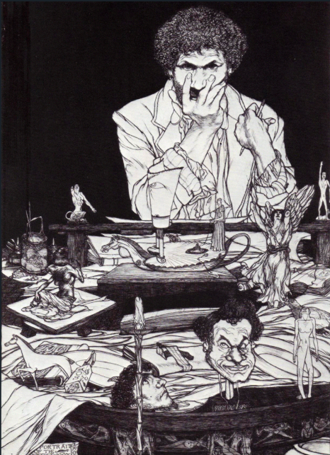
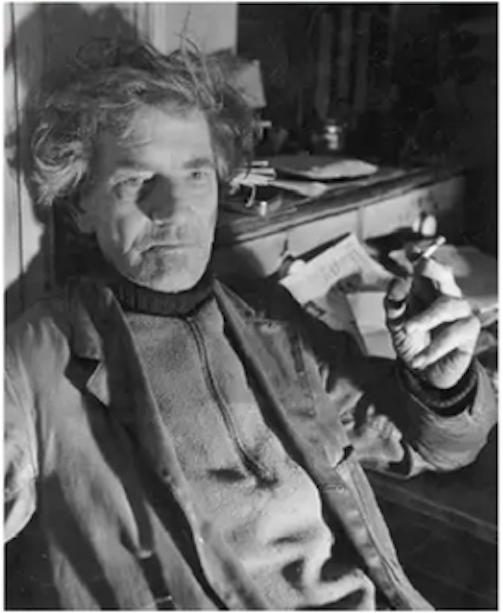

# オースティン・オスマン・スペア『快楽の書』の翻訳＋注釈Zine──ZOS/KIAと魔術の原点

本Zineは、オースティン・オスマン・スペア（Austin Osman Spare, 1886–1956）の代表作『The Book of Pleasure（Self-Love）』の全文翻訳および注釈を収録している。

**by 知られざる呪術師（*Le Sorcier Inconnu*）**  

ディスコーディアン暦3191年 ZosとKiaの祝日第52日曜日  
――手✋と目👁によるクラフトが深淵🌀を超えた記念日  

---

 

 

画像出典：Portrait of the Artist by Austin Osman Spare, 1907. Source: WikiArt. Public Domain..

 

---

## 🗂 目次
 
- [01 定義](01_definitions.md)

- [02 宗教と教義──快楽・自由・力への道具として](02_on_religion_and_faith.md)

- [03 宗教を消費するもの](03_self_love_and_sigils.md)

- [04 神性についての内なる問い](04_kia_and_neither_neither.md)

- [05 死の姿勢 (Death Posture)](05_death_posture.md)

- [06 停滞した自己催眠が生み出す濁った敵](06_soliloquy_on_godhead.md)

- [07 自己愛を語る前に](07_on_duality_and_ecstasy.md)

- [08 魔術の儀式と教義──完全版](08_closing_remarks.md)

---
## オースティン・オスマン・スペア（Austin Osman Spare, 1886–1956）
<table> <tr> <td style="vertical-align:top; padding-right:20px;">
20世紀初頭のロンドンに生きた芸術家・魔術師・思想家。17歳でロンドン王立芸術アカデミーの権威あるサマー・エキシビションに作品が展示され、若き芸術の天才と称賛された。10代で画壇の寵児となるも、既存の芸術・宗教・魔術体系すべてに背を向け、自らの内的ヴィジョンに従った独自の魔術体系「Zos Kia」を構築。シジル魔術や自己愛を軸にした極めて個人的・即興的な実践を展開した。ケイオスマジックの先駆者として評価される一方で、その文体と思想の難解さゆえに誤読も多く、没後もなお再評価と誤解が交差する存在である。代表作に『The Book of Pleasure（快楽の書）』『Anathema of Zos』など。
</td> <td>  </td> </tr> </table>

---

## スペア文体の翻訳方針について

Austin Osman Spareの著作は、逆説・省略・文法逸脱・造語を多用した特異な文体で書かれており、通常の英文読解とは異なる集中と解釈力を要求する。とりわけ『The Book of Pleasure』では、彼独自の思想体系（Kia／Zos／Neither-Neither）と、魔術的実践における内的感覚が強く結びついており、文章自体が「儀式的な作用」を意図して構成されている節がある。本翻訳では、逐語訳に固執せず、身体感覚と直観を重視した意訳を行い、日本語として読める最低限の流れを確保することを優先した。また、難解な文が多く読みにくい箇所もあるため、原文に二重否定が含まれている場合には、読解の負担を軽減するために、同じ意味の肯定文に置き換えて訳した箇所がある。さらに、用語や論理の不明瞭さを「原文の特性」として保持する箇所も多い。読者においては、「読みにくさ」それ自体をスペアの文体的特徴として受け入れ、魔術的言語実践の一環として向き合われたい。

---

## 🐌 ZOSとKIA──スペアと後世の違い

オースティン・オスマン・スペアが定義したZOS/KIAは、体系化された神話や教義ではなく、個人の身体と意識を通じて体験される私的で変成的な魔術であった。一方、ケニス・グラントの「Zos Kia Cultus」は、これらの概念を神話的体系として整理し、象徴や儀礼、階層構造の中に再配置したものである。この違いは、ラヴクラフトが描いた「名状しがたい混沌」を、後年オーガスト・ダーレスが善悪の神話体系へと再編した構図によく似ている。ZOS＝男性原理／KIA＝女性原理という解釈も一部に存在するが、スペア本人のテキストにおいて、性別の固定的な割り当ては行われていない。むしろ彼は「Neither-Neither（いずれでもない）」という非二元的状態を重視し、善悪・性・意味といったあらゆる二項対立を超越する態度を貫いている。

---
## 🗃 関連資料

その他のオースティン・オスマン・スペアによる文書の翻訳Zineも公開中。
 
 
👉👉👉 [『ゾスの呪詛――偽善者たちへの説教 (Anathema of Zos)』を読む](https://github.com/ravensgate-tux/Anathema_of_Zos/blob/main/README.md)
 
 
👉👉👉 [『半獣人たちの書(A book of Satyes)』を読む](https://github.com/ravensgate-tux/book_satyrs/blob/main/README.md) 
 
📚『半獣神たちの書（A Book of Satyrs）』について 
本書は1907年に刊行されたオースティン・オスマン・スペアによる初期の画集であり、彼の特異な美学と魔術的想像力を色濃く映し出す図版が多数収録されている。**スペア自身による文章はもともと含まれていない**が、詩人であり私家版出版社「ペア・ツリー・プレス（Pear Tree Press）」の主宰でもあったジェームズ・ガスリー（James Guthrie）による序文が添えられており、当時の芸術的・社会的背景のもとにスペアの作品を位置づけている。
この序文は、スペアの絵画が持つサタイア（風刺）性や想像力、そして「予測不能な意図」に対して独自の評価を与えており、のちの『快楽の書』や『ゾスの呪詛』へと展開する思想の原型を、視覚芸術の面から捉える一助となるだろう。
  
👉👉👉[『地上の地獄（Earth Inferno)』を読む](https://github.com/ravensgate-tux/earth_inferno/blob/main/README.md)
 
 
📚『地上の地獄（Earth Inferno, 1905）』について 
『地上の地獄』は、オースティン・オスマン・スペアが20歳で自費出版した最初の著作であり、詩と図像が交錯する幻想的なアートブックである。ダンテ『神曲』に着想を得つつも、内容はスペア独自の魔術思想に満ちており、道徳や宗教への挑発と内的探求が、ページごとに濃密に展開される。視覚と言葉を通じた魔術的実践の先駆的表現といえるだろう。

本書では後年の主要概念「ZOS-KIA」ではなく、より原初的なかたちとして「ZOD-KIA」という語が用いられており、信仰・死・苦悩による支配的構造を象徴していると読み取れる。この「ZOD-KIA」は、後のスペアが構想した能動的・創造的統合体「ZOS-KIA」へと至る前段階として重要な概念であり、思想の進化を読み解く鍵ともなる。

---

## ⚖️ 著作権および利用に関して

本Zineに収録された翻訳文および注釈は、Austin Osman Spareの著作『The Book of Pleasure（Self-Love）』の原文（パブリックドメインまたはCCライセンス下の版）をもとに、日本語圏における理解促進を目的として作成された。翻訳および注釈部分の著作権は、翻訳者・編者に帰属する。ただし、本Zine全体は以下のライセンス条件に従って公開される。

---

© 2025 知られざる呪術師（Le Sorcier Inconnu）  
本ドキュメントは [Creative Commons BY-SA 4.0](https://creativecommons.org/licenses/by-sa/4.0/deed.ja) に基づき公開されています。
